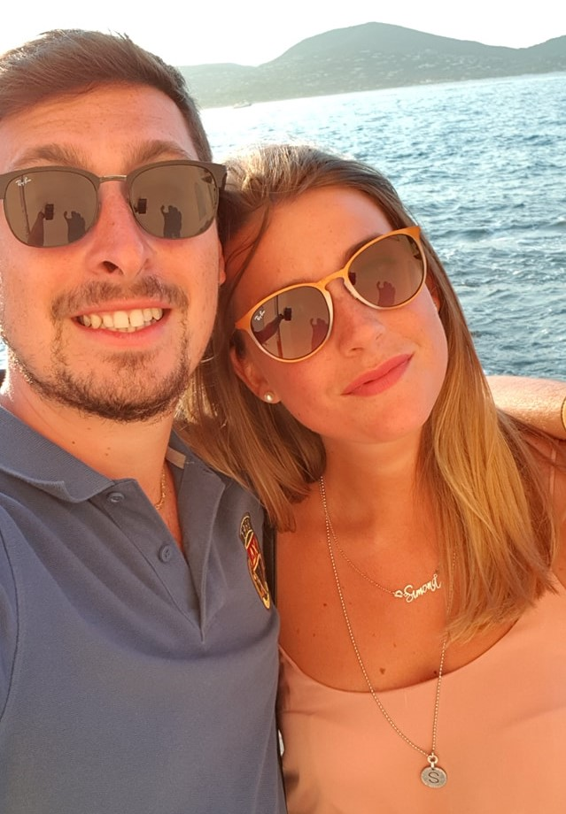
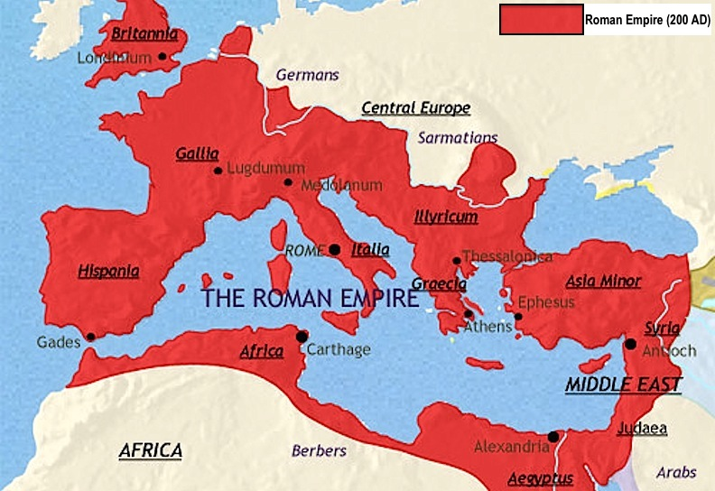
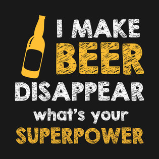

1. My name is Saverio Guardato, but I guess you already knew that

2. I live in Italy and I am a very proud of my culture and the history of my country (I love ancient Rome)

3. I graduated in Software Engineering and I consider myself a tech lover. I Love soccer (FORZA NAPOLI!), motors (bikes and cars) rock music and beer

4. I work as Application Development Manager for Microsoft and I love my job. I try to put all my passion for technology and business everyday and sometimes I share on this blog experiences from the field and chats about technology

5. I am technology addicted and I consider myself a computer EngiNerd =)
